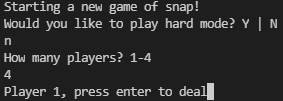

# java-card-project

A simple "card game" coded in Java

# How to play

Build the project and then run! You'll be given the option of playing hard mode (requiring you to type "snap" in a time limited window to win), or easy mode, and a choice of how many players are playing. Just follow the prompts in the console!

